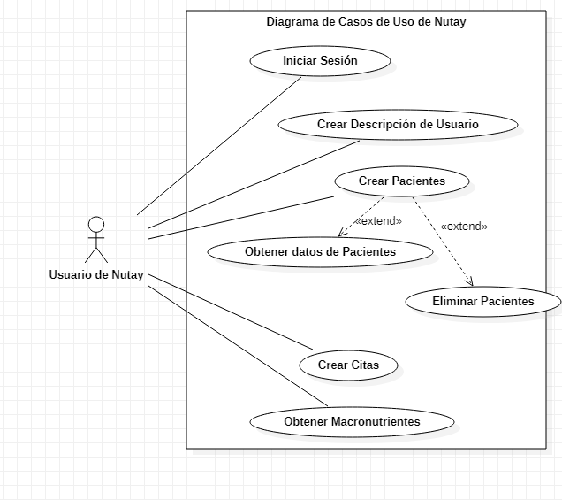

# DIAGRAMA DE CASOS DE USO

### 1.

### Páginas
* [Página principal](index.md)
* [Diagrama de Clases](CasosUso.md)
* [Casos de Uso](CasosUso2.md)
* [Diagramas de secuencia](secuencias.md)
* [Historias de usuario](HistoriasUsuario.md)

#### Contacto
En caso de tener dudas favor de contactar a [este_correo_no_existe@hotmail.com](https://outlook.live.com/owa/)
