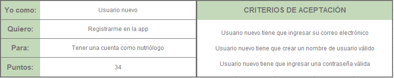
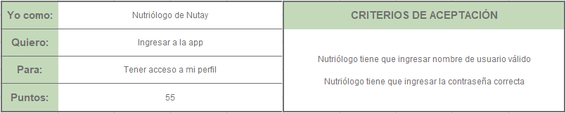
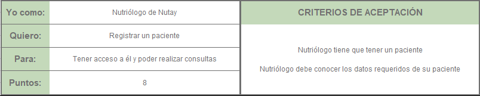
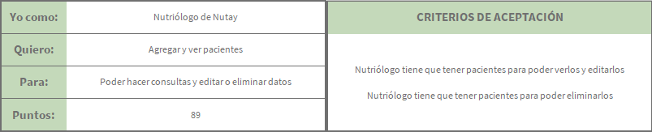
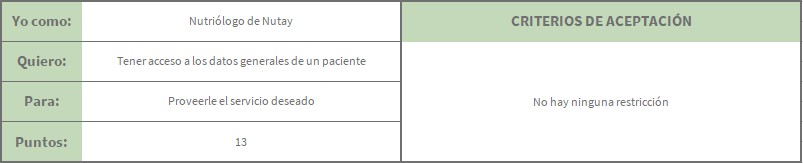
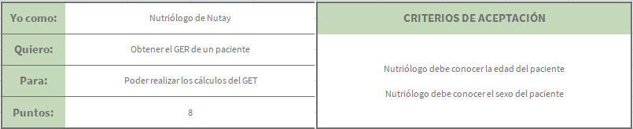
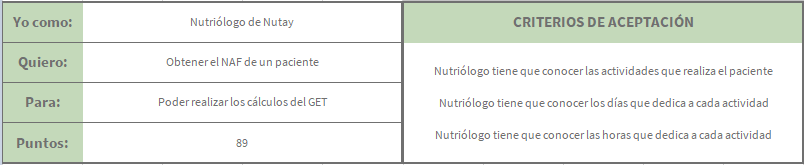
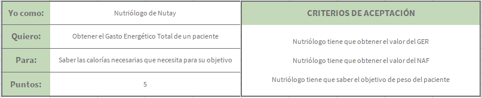
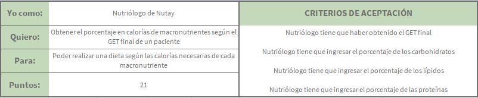

# HISTORIAS DE USUARIO

### Registrar nutriologo: [34](Tareas/registrar.md)

### Ingresar: [55](Tareas/registrar.md)

### Registrar paciente: [8](Tareas/registrarp.md)

### Ver pacientes: [89](Tareas/ver_pacientes.md)

### Acceder a datos del paciente: [13](Tareas/acceder.md)

### Calcular GER del paciente: [8](Tareas/ger.md)

### Calcular NAF del paciente: [89](Tareas/naf.md)

### Calcular GET del paciente: [5](Tareas/get.md)

### Obtener porcentaje de calorias: [21](Tareas/caloriasp.md)

### Páginas
* [Página principal](index.md)
* [Casos de uso](CasosUso.md)
* [Diagramas de secuencia](secuencias.md)
* [Historias de usuario](HistoriasUsuario.md)

#### Contacto
En caso de tener dudas favor de contactar a [este_correo_no_existe@hotmail.com](https://outlook.live.com/owa/)
