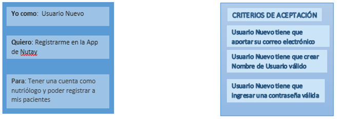
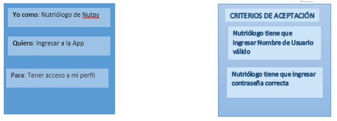
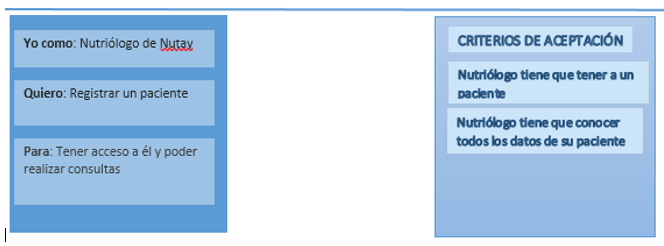
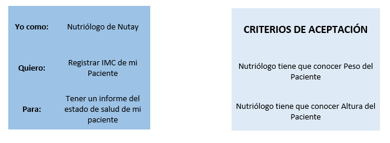
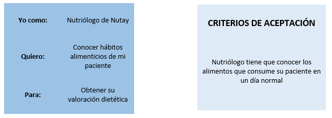
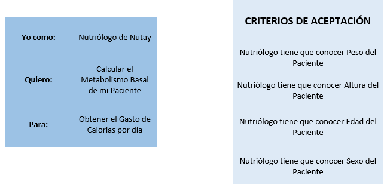
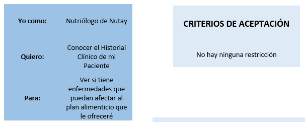
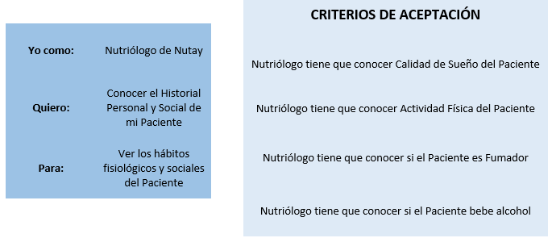

# HISTORIAS DE USUARIO

### Registrar usuario

### Ingresar

### Registrar paciente

### Registrar IMC

### Conocer hábitos alimenticios

### Calcular metabolismo basal

### Historial clínico

### Historial personal

### Páginas
* [Página principal](index.md)
* [Casos de uso](CasosUso.md)
* [Diagramas de secuencia](secuencias.md)
* [Historias de usuario](HistoriasUsuario.md)

#### Contacto
En caso de tener dudas favor de contactar a [este_correo_no_existe@hotmail.com](https://outlook.live.com/owa/)
